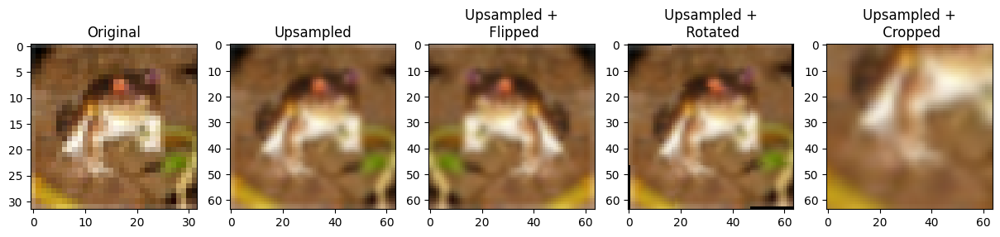
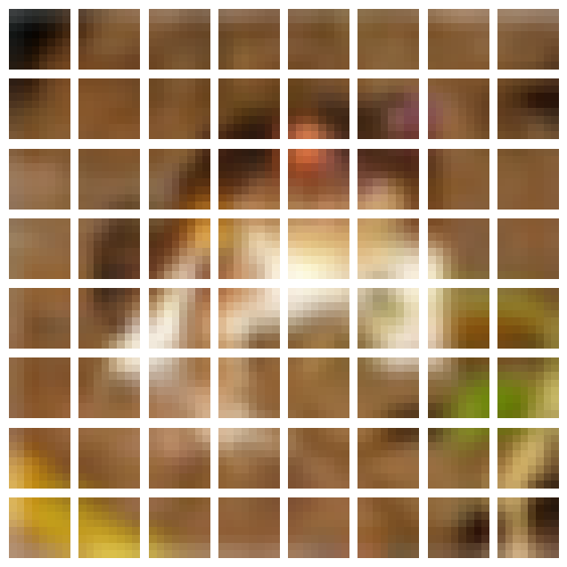
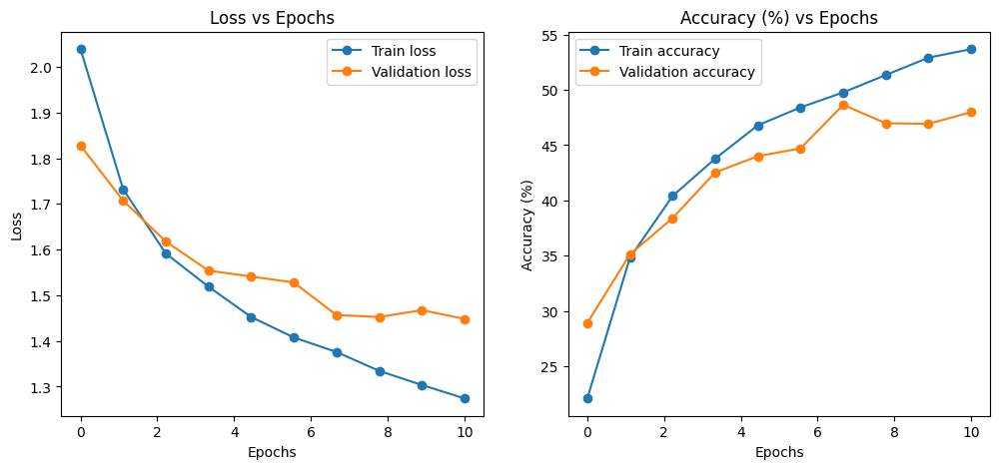

# Overview
Project is about a PyTorch Vision Transformer implementation, used as a Proof of Concept with Cifar10 Dataset.\\
Vision transformer reference can be found at https://arxiv.org/abs/2010.11929v2.

# Data upsampling and data augmentation
Data have been upsampled to 64x64.

The following augmentations have been applied
- Flip
- Random rotation
- Zoom

# Patching
Images have been patched in order to be flatteneed and concatenated with indices.

# Training

These results are not competitive. In order to enhance accuracy
 - More data could be used for traiing
 - The number of epochs could be increased
 - The model hyperparameters could be changed

 # Model visualization
 